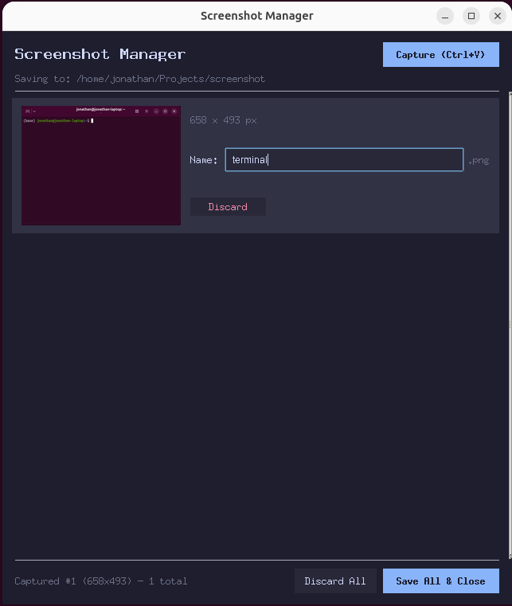

# Screenshot Manager for Claude Code

A Claude Code skill that saves clipboard screenshots as named files in your project directory.

You can paste images into Claude Code's chat, but sometimes you need the screenshot as an actual file on disk — to pass to an MCP tool, include in a project, upload to a service, or reference by path. Without this, that means switching to a file manager, saving, navigating to the right folder, picking a name, and switching back. This does it in one step.

  



## What it does

Type `/screenshots` in Claude Code and a browser tab opens where you can:

- **Ctrl+V** — capture a screenshot from your clipboard
- Name each screenshot
- **Ctrl+S** — save all to your current working directory

Claude gets structured JSON output with the saved file paths and dimensions, so it can immediately work with your screenshots.

## Prerequisites

- Python 3 (standard library only — no pip packages needed)

## Install

```bash
git clone https://github.com/jondufault/claude-screenshots.git
cd claude-screenshots
bash install.sh
```

This installs:
- `screenshot-manager` to `~/.local/bin/` (Linux/macOS) or `%LOCALAPPDATA%\Programs\screenshot-manager` (Windows)
- The `/screenshots` Claude Code skill to `~/.claude/commands/`

## Usage

In any Claude Code session:

```
/screenshots
```

Claude will launch the manager in a browser tab in the background. Take your screenshots, paste and name them, then save. Claude picks up the results automatically.

## How it works

The script starts a local HTTP server on a random port (bound to `127.0.0.1` only) and opens a browser tab pointing to it. All image handling happens in the browser — clipboard paste, preview, naming. When you save, the browser sends the images to the server which writes them to disk and prints JSON results to stdout for Claude to pick up.

## Uninstall

```bash
rm ~/.local/bin/screenshot-manager
rm ~/.claude/commands/screenshots.md
```

## License

MIT
